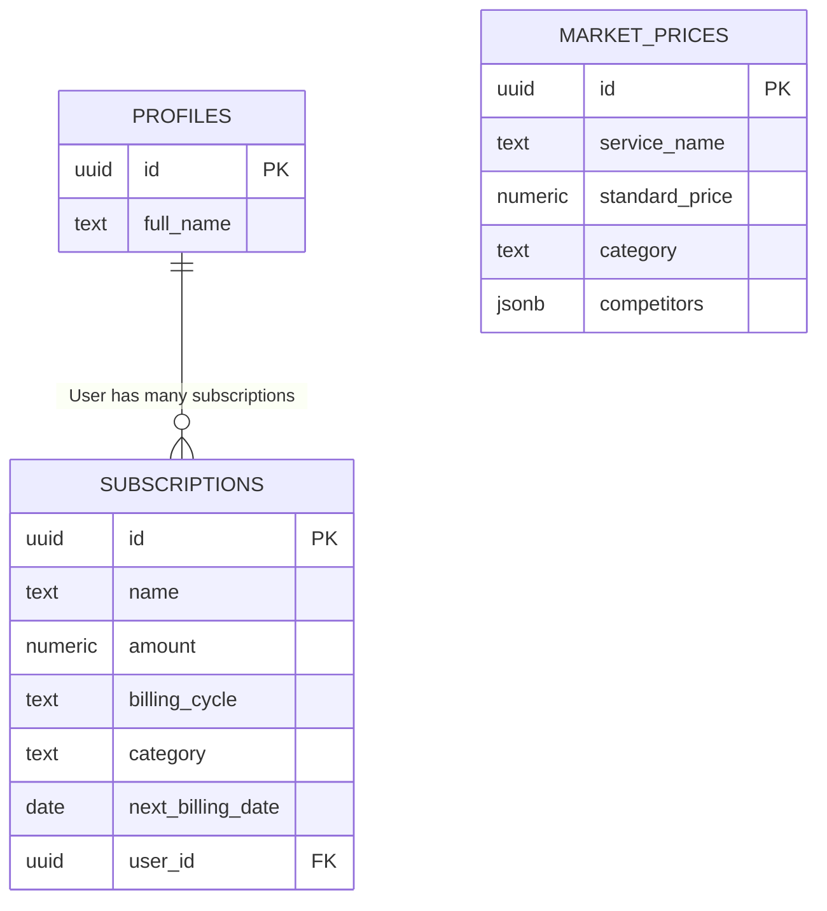

# Subwise - פתרון חכם לניהול מנויים פיננסי

**🌐 קישור לפרויקט חי (Vercel):** [הוסף כאן את הקישור ל-Vercel לאחר שתעלה את הפרויקט]

## 1. סקירה כללית
**Subwise** הוא לוח בקרה פיננסי חכם (Dashboard) המסייע למשתמשים לעקוב, לנהל, ולייעל את ההוצאות החודשיות שלהם על מנויים שונים (כגון: נטפליקס, ספוטיפיי, תוכנות וכו'). באמצעות שילוב של בינה מלאכותית, המערכת מנתחת את הוצאות המשתמש ומציעה המלצות לחיסכון כסף.

## 2. הבעיה שהפרויקט פותר
בעידן הדיגיטלי, אנשים נרשמים לעשרות שירותים שונים (סטרימינג, תוכנות עבודה, גיימינג). כתוצאה מכך נוצרת "עייפות מנויים" - קשה לעקוב אחרי מועדי החיוב, המשתמשים שוכחים לבטל שירותים שאינם בשימוש, ומשלמים כסף מיותר על שירותים חופפים או על מסלולים יקרים ללא צורך. רוב האנשים מפסידים כך מאות שקלים בשנה.

## 3. קהל היעד
- **צרכנים דיגיטליים וסטודנטים:** אנשים שצורכים שירותי בידור ותוכנה באופן קבוע ורוצים לצמצם הוצאות חודשיות.
- **עצמאיים (פרילנסרים):** שמשתמשים בהמון שירותי SAAS (כגון כלי AI, אחסון וכו') וזקוקים לראות את כולם בצורה מרוכזת כדי לחשב הוצאות מוכרות או לבטל כפילויות.

## 4. מתחרים ובידול
**הפתרונות הקיימים כיום בשוק (מתחרים):**
1. **אקסל / Notion:** ביצוע מעקב ידני. חסרונות: דורש הקלדה ועבודה סיזיפית, לא מתריע על עליות מחירים, ואין שום המלצות חכמות.
2. **אפליקציות הבנק:** מציגות את כלל ההוצאות אבל לא מפרידות בצורה חכמה רק את המנויים החוזרים ולא יודעות להציע "חלופה זולה יותר לספוטיפיי".
3. **אפליקציות ייעודיות בארה"ב (כמו Rocket Money):** עמוסות מאוד, לא תמיד נתמכות בישראל, וממוקדות לרוב בשוק האמריקאי.

**הבידול של Subwise:**
* **דיוק ועיצוב נקי (Technological Precision):** ממשק משתמש פשוט, מהיר וללא רעשי רקע (בהתאם ל-Design System).
* **AI אינטגרטיבי ופרואקטיבי:** בניגוד לטבלת אקסל פסיבית, Subwise סורק את המנויים ומציף "תובנות" (Insights) בזמן אמת - לדוגמה, אם יש למשתמש גם ספוטיפיי וגם יוטיוב פרימיום, המערכת תציע לבטל אחד מהם כדי לחסוך עשרות שקלים.

## 5. מודל הנתונים (תרשים ERD)
מערכת הנתונים נבנתה ב-Supabase ומכילה טבלאות לניהול פרופילים, שמירת המנויים הספציפיים של כל משתמש, ומחירון שוק מעודכן של מנויים נפוצים.



## 6. רשימת שירותים חיצוניים ואינטגרציות

| שירות | סוג | למה משמש |
| --- | --- | --- |
| **Supabase Auth** | אוטנטיקציה | הרשמה והתחברות מאובטחת של משתמשים למערכת (Email/Password & OAuth). |
| **Supabase Database** | בסיס נתונים / API | שמירה וקריאה של נתוני מנויים ופרופילים בצורה מאובטחת באמצעות RLS. |
| **Grok API (x.ai)** | קריאת API | מנוע הבינה המלאכותית האחראי על ניתוח המנויים של המשתמש והפקת המלצות חכמות לחסכון. |
| **Supabase Edge Function** | לוגיקת שרת | שרת ללא-תשתית המשמש מתווך (Proxy) לקריאות ה-AI. תפקידו להסתיר את מפתח ה-API של Grok מקוד הצד-לקוח, ולשמור על אבטחה גבוהה. |

---

## 🚀 הוראות הרצה בסיסיות (לפיתוח מקומי)

1. שיבוט הפרויקט: `git clone`
2. התקנת תלויות: `npm install`
3. יצירת קובץ `.env.local` והזנת המפתחות (הציבוריים בלבד!):
   ```env
   VITE_SUPABASE_URL=your_supabase_url
   VITE_SUPABASE_ANON_KEY=your_supabase_anon_key
   ```
4. הפעלת הפרויקט: `npm run dev`
*הערה: על מנת שתכונות ה-AI יעבדו, יש לפרוס את פונקציית השרת (Edge Function) באמצעות הפקודה `supabase functions deploy grok-chat`.*
